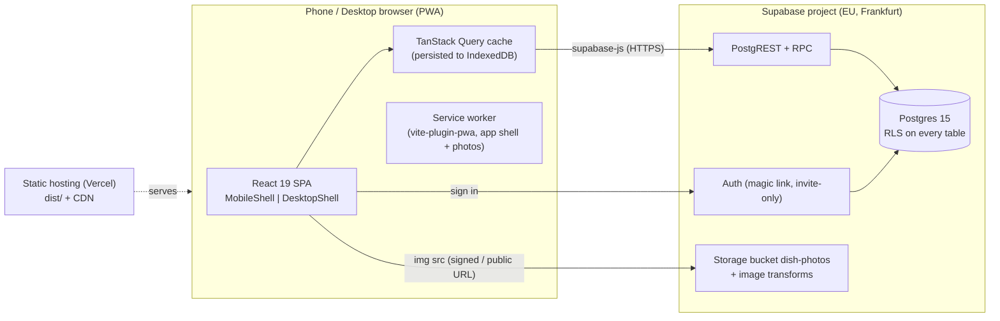

# Ведмідь — Technical Specification

Version 1.0 · 2026-09-27 · Status: **approved for implementation**
Related: [DESIGN.md](DESIGN.md) · [BACKLOG.md](BACKLOG.md) · [../AGENTS.md](../AGENTS.md) · schema [`supabase/migrations/0001_init.sql`](../supabase/migrations/0001_init.sql) · design proposal https://claude.ai/artifact/HsMvF2sG8wqS3NCFbpGQNc

---

## 1. Executive Summary
«Ведмідь» is an internal knowledge base and training app for the waiters of the restaurant **«Просто ЛІС»**. Staff look up dishes and drinks during service (composition, allergens, pairing, a sales phrase), learn the menu with flashcards, and test themselves with games that award XP and achievements.

The current code is a Google AI Studio prototype: a frontend-only SPA with hard-coded data and localStorage persistence. This spec replaces it with:
- a **redesigned UI** (new_design.pdf) delivered as two layouts, **mobile** (primary) and **desktop**, over one shared core;
- a **light backend on Supabase**, which gives one source of truth for the menu, per-waiter accounts and synced progress, and a manager role that edits the menu and uploads dish photos;
- a smaller scope: Menu, Flashcards, Games and Profile. The advisors, steak guide, gastro-constructor and .txt import are removed.

Business outcomes: new waiters reach menu fluency faster, fewer allergen mistakes are made at the table, and the menu stays up to date without a developer.

## 2. Requirements

### 2.1 Functional
| ID | Requirement |
|---|---|
| F1 | Staff sign in with an email magic link. Only invited emails can sign in |
| F2 | Two roles: `waiter` (read menu, own progress) and `manager` (everything plus menu CRUD, photo upload, invite staff) |
| F3 | Browse the menu by category → subcategory; search across title, ingredients, allergens, anchor and grapes |
| F4 | Item detail: photo, title, allergens, ingredients, pairing, sales phrase, interesting fact; wine extras (grapes, sweetness, producer, taste profile) |
| F5 | Flashcards per category with «знаю / не знаю», Leitner spaced repetition, progress synced per user |
| F6 | Games: quiz, match, recipe, guest. Each answer is recorded server-side and awards XP |
| F7 | Profile: level, rank, XP, streaks, accuracy, per-category knowledge, achievements |
| F8 | Manager: create/edit/deactivate items, upload/replace photos, invite waiters, change roles |
| F9 | Mobile layout below 1024px, desktop layout at 1024px and wider, both with feature parity except F8 (desktop only) |
| F10 | Works offline for reading (cached menu) and queues answers until the connection returns |

### 2.2 Non-functional
| Area | Target |
|---|---|
| Users | 1 restaurant, ≤ 50 staff, ≤ 30 concurrent at peak |
| Data | ~200 items, ~200 photos (≤ 300 KB each), < 1 MB of progress rows per year |
| Performance | Mobile LCP < 2.5s on mid-range Android over 4G; the menu is interactive from cache in < 1s on repeat visits; search < 50ms client-side |
| Bundle | Initial JS ≤ 180 KB gzip for the mobile shell; the desktop shell and manager are lazy chunks |
| Availability | Best effort (Supabase free/pro SLA). The app must stay readable offline |
| Accessibility | WCAG 2.2 AA except the documented on-green exception (DESIGN §2) |
| Browsers | iOS Safari 16+, Android Chrome 110+, desktop Chrome, Edge, Firefox and Safari (last 2 versions) |
| Localisation | Ukrainian only |

### 2.3 Assumptions
- Staff have personal smartphones with a camera and email access. The restaurant has Wi-Fi that is sometimes unreliable.
- One manager (or a few) maintains the menu. There are no POS or iiko integrations in v1.
- Existing `src/data/*.ts` content is accurate and becomes the initial seed.
- Budget: free tiers where possible (≈ $0–25/month).

### 2.4 Constraints
- Keep the current stack (React 19, Vite 6, TypeScript 5.8, Tailwind 4, lucide, motion).
- No custom server to operate. Supabase is the only backend.
- Personal data is limited to name and email (GDPR-style minimisation, see §6).

## 3. Architecture options considered
| | A · Lowest cost | **B · Balanced (chosen)** | C · Enterprise |
|---|---|---|---|
| Shape | Keep static data in the bundle, localStorage progress, redeploy to change the menu | SPA + Supabase (Postgres, Auth, Storage, RLS, RPC) | SPA + own API (NestJS on Cloud Run) + Postgres + CMS + SSO |
| Cost | $0 | $0 (free) → $25 (Pro) | $100+/mo |
| Menu edits | Developer only | Manager in-app | Manager in CMS |
| Progress sync | No | Yes | Yes |
| Ops | None | Minimal (managed) | Real on-call burden |
| Risk | Menu drifts, no accountability | Vendor lock-in (mitigated: plain Postgres + SQL migrations) | Over-engineered for 50 users |

**B is chosen.** It is the smallest step that satisfies manager editing and synced progress. Its free tier fits the scale, and since the data is plain Postgres it can move elsewhere later.

## 4. Proposed Architecture

### 4.1 High-level


### 4.2 Frontend component design
```
src/
  app/            App.tsx (shell switch), router.tsx, providers/{QueryProvider,AuthProvider}.tsx, RequireAuth, RequireRole
  shells/mobile/  MobileShell.tsx, BottomNav usage, safe-area handling
  shells/desktop/ DesktopShell.tsx, Sidebar usage, keyboard shortcuts (useHotkeys)
  features/
    menu/        api.ts, hooks/{useMenu,useMenuSearch,useItem}.ts, components/{ItemCard,ItemDetailContent,WineExtras}.tsx,
                 views/mobile/{MenuListView,ItemDetailView}.tsx, views/desktop/MenuPanesView.tsx
    flashcards/  leitner.ts (pure), hooks/useDeck.ts, components/Flashcard.tsx, views/{mobile,desktop}/CardsView.tsx
    games/       engines/{quiz,match,recipe,guest}.ts (pure), hooks/useGameSession.ts, views/{mobile,desktop}/…
    profile/     achievements.ts, rank.ts, hooks/useStats.ts, views/{mobile,desktop}/ProfileView.tsx
    manager/     api.ts, hooks/*, views/desktop/{ManagerTable,ItemDrawer,InviteDialog}.tsx, views/mobile/DesktopOnly.tsx
    auth/        views/LoginView.tsx (one responsive view)
  ui/            Logo, SearchInput, Chip, ChipRow, SectionTitle, ItemCard?, SegmentedTabs, Panel, Photo, Button, Tag,
                 BottomNav, Sidebar, StatTile, ProgressBar, Toast, Skeleton
  lib/           supabase.ts, queryClient.ts, useMediaQuery.ts, shuffle.ts, offlineQueue.ts, db.types.ts (generated)
  styles/        tokens.css
```
**Shell selection** (`app/App.tsx`):
```tsx
const isDesktop = useMediaQuery('(min-width: 1024px)');
const Shell = isDesktop ? DesktopShell : MobileShell; // both React.lazy
return <Suspense fallback={<SplashSkeleton/>}><Shell><Outlet/></Shell></Suspense>;
```
Each route element is a tiny switch: `<LayoutSwitch mobile={<MenuListView/>} desktop={<MenuPanesView/>}/>`. **Rule:** views only compose; all data access and logic live in `hooks/`, `engines/` and `api.ts`, which are shared by both layouts.

**Routes**
| Path | Guard | Mobile view | Desktop view |
|---|---|---|---|
| `/login` | public | LoginView | LoginView |
| `/` | auth | → `/menu` | → `/menu` |
| `/menu` | auth | MenuListView | MenuPanesView |
| `/menu/:itemId` | auth | ItemDetailView | MenuPanesView (item selected) |
| `/cards` | auth | CardsView | CardsView (desktop) |
| `/games` · `/games/:mode` | auth | GamesListView · GameRunView | GamesGridView · GameRunView |
| `/profile` | auth | ProfileView | ProfileView (desktop) |
| `/manager` | auth + role=manager | DesktopOnly | ManagerView |
| `*` | — | NotFound | NotFound |

State management: server state lives in **TanStack Query** (no Redux). UI state is local `useState`, or URL search params for the category and query (`/menu?c=wine&q=сухе`) so that the back button and deep links work.

### 4.3 Data flow
1. **Menu read.** `useMenu()` fetches categories, subcategories and active `menu_items` as three parallel requests (`fetchMenu` in `features/menu/api.ts`). It caches the raw rows under `['menu']`, builds the domain model with a memoized `select`, and uses `staleTime` 10 min. It is persisted to IndexedDB via `@tanstack/query-async-storage-persister` (`maxAge` 7 days). On app start, cached data renders instantly, then revalidates.
2. **Search.** Client-side over the cached list: normalise (lowercase, strip apostrophes and ’ʼ), then match `includes` against the concatenated fields. There is no server search, since there are only 200 items.
3. **Answer.** Flashcard, quiz or other → `rpc('record_answer', {p_item_id, p_correct, p_source})`. This updates `card_progress` (flashcards), `player_stats` (XP/streak) and returns `{xp, level, streak, new_achievements[]}`. The UI shows toasts for level-ups and achievements. Offline, the call is pushed to `offlineQueue` (IndexedDB) and flushed on the `online` event and on app focus, in order. XP from queued answers is recalculated server-side.
4. **Game result.** `rpc('finish_game', {p_mode, p_score, p_total})` inserts into `game_results`.
5. **Manager edit.** Upsert into `menu_items` (RLS allows managers only), then invalidate the `['menu']` query. A photo goes to `dish-photos/{item_id}/{uuid}.webp` and `photo_path` is updated.

### 4.4 API design (Supabase)
All access goes through `supabase-js` with the anon key plus the user JWT. RLS enforces permissions. Generated types come from `supabase gen types typescript > src/lib/db.types.ts`.

| Operation | Call | Who |
|---|---|---|
| List menu | `from('menu_items').select('*, subcategory:subcategories(id,name,sort,category:categories(slug,name,sort))').eq('is_active', true)` | authenticated |
| Categories/subcategories | `from('categories').select('*, subcategories(*)').order('sort')` | authenticated |
| My progress | `from('card_progress').select('*')` (RLS → own rows) | authenticated |
| My stats | `from('player_stats').select('*').single()` | authenticated |
| My achievements | `from('user_achievements').select('*')` | authenticated |
| Guest scenarios | `from('guest_scenarios').select('*').eq('is_active', true)` | authenticated |
| Record answer | `rpc('record_answer', { p_item_id uuid\|null, p_correct bool, p_source 'card'\|'quiz'\|'match'\|'recipe'\|'guest' })` → `{ xp, level, streak, max_streak, new_achievements text[] }` | authenticated |
| Finish game | `rpc('finish_game', { p_mode, p_score int, p_total int })` | authenticated |
| Menu CRUD | `from('menu_items').insert/update` | manager |
| Photo upload | `storage.from('dish-photos').upload(path, file, { upsert: true, contentType: 'image/webp' })` | manager |
| Invite waiter | Edge Function `invite-staff` (POST `{email, display_name}`) → `auth.admin.inviteUserByEmail` with the service role (never in the client) | manager |
| Change role | `rpc('set_role', { p_user uuid, p_role })` | manager |

**XP rules** (server-side in `record_answer`): card «знаю» +5, quiz correct +10, match pair +5, recipe perfect dish +15, guest correct +20, wrong answer 0 and streak reset. A wrong match pair and a quiz timeout both count as wrong answers. There is no bonus XP for finishing a game (the prototype awarded it in the browser). Rate cap: max 120 answers per user per 10 minutes, after which XP is 0 (anti-farming). Level = `floor(xp/250)+1`.

### 4.5 Flashcards: Leitner
- Boxes 1–5, intervals 0, 2, 4, 7, 14 days. «знаю» → box+1 (max 5); «не знаю» → box 1.
- `due = reviewed_at + interval[box]`. The deck contains due cards (oldest first), then unseen items, shuffled with Fisher–Yates (`lib/shuffle.ts`). This replaces `sort(() => Math.random() - 0.5)`.
- `leitner.ts` and the session reducer `session.ts` are pure and 100% covered. The server stores `box`, `last_result` and `reviewed_at`; the client updates its cached copy optimistically.
- A session's deck is fixed when it starts. «ще раз» reshuffles the same cards; «лише помилки» keeps the misses. If nothing is due, the user can practise all cards. Known gap: early repeats currently still advance boxes on the server (follow-up E4-4).

### 4.6 Data architecture
Postgres schema: see `supabase/migrations/0001_init.sql`. Summary:

| Table | Key columns | Notes |
|---|---|---|
| `profiles` | `id uuid pk → auth.users`, `display_name`, `role staff_role` | Row created by trigger on signup |
| `categories` | `id smallint`, `slug`, `name`, `sort` | 5 rows seeded |
| `subcategories` | `id`, `category_id`, `name`, `sort` | Unique (category, name) |
| `menu_items` | `id uuid`, `legacy_id text unique`, `subcategory_id`, `title`, `anchor`, `ingredients`, `sales`, `interesting_fact`, `pairing`, `allergens text[]`, `grape_varieties`, `sweetness`, `taste_profile jsonb`, `producer jsonb`, `is_bestseller`, `is_finalist`, `photo_path`, `sort`, `is_active`, `updated_at`, `updated_by` | 1:1 with `MenuItem` |
| `card_progress` | pk `(user_id, item_id)`, `box`, `last_result`, `reviewed_at`, `times_seen`, `times_known` | Owner-only |
| `player_stats` | `user_id pk`, `xp`, `streak`, `max_streak`, `correct_answers`, `total_answers`, `updated_at` | Written only by RPC |
| `answer_log` | `id bigserial`, `user_id`, `item_id`, `source`, `correct`, `xp_awarded`, `created_at` | Audit, rate limiting, analytics |
| `game_results` | `id`, `user_id`, `mode`, `score`, `total`, `created_at` | |
| `achievements` | `id text pk`, `title`, `description`, `icon`, `xp_reward`, `rule jsonb` | Seeded in `0001_init.sql` (from the legacy `achievementsList`); rules are declarative (`{"metric":"xp","gte":100}`) |
| `user_achievements` | pk `(user_id, achievement_id)`, `unlocked_at` | Written only by RPC |
| `guest_scenarios` | `id`, `persona`, `avatar`, `quote`, `options jsonb`, `is_active` | Seeded from `src/legacy/components/GameTab.tsx` `guestScenarios` |

**Field mapping `MenuItem` → `menu_items`:** `id`→`legacy_id` · `category`+`subcategory`→`subcategory_id` · `title`, `anchor`, `ingredients`, `sales` (same) · `interestingFact`→`interesting_fact` · `pairing` · `allergens` · `grapeVarieties`→`grape_varieties` · `sweetness` · `profile`→`taste_profile` · `producer` · `isBestseller`→`is_bestseller` · `isFinalist`→`is_finalist`. The frontend `MenuItem` type is regenerated from DB types, with a thin mapper in `features/menu/api.ts`.

**Category mapping:** `Їжа`→`food` («їжа») · `Вино`→`wine` («вино») · `Коктейлі`→`cocktails` («коктейлі») · `Безалкогольні & Пиво`→`beer_soft` («пиво») · `Міцні напої`→`spirits` («міцні»).

Seeding: `supabase/seed.ts` (run with `tsx`) imports `menuData` from `src/data/menuData.ts` (typed `SeedMenuItem`), validates every item with `menuItemInputSchema`, and upserts by `legacy_id` using the service-role key from `.env.seed` (never committed). The default mode inserts only missing rows, so it is idempotent and never overwrites managers' edits; `--overwrite` resets existing rows, and `--dry-run` only validates. Taste profile values run 0–3 (0 = none, e.g. the strength of a mocktail).

### 4.7 Security design
- **AuthN:** Supabase Auth, email OTP/magic link, **public signups disabled**. Staff are added via the `invite-staff` Edge Function (manager only). Session in localStorage via supabase-js with PKCE flow. Redirect URLs allow-listed (prod + preview domains).
- **AuthZ:** RLS enabled on every table (`alter table … enable row level security`), default deny. Helper `is_manager()` is a `security definer` function reading `profiles.role`. Progress tables allow `user_id = auth.uid()` for select only. Writes go through `security definer` RPCs with `set search_path = public`.
- **Client:** only `VITE_SUPABASE_URL` and `VITE_SUPABASE_ANON_KEY` are shipped. The service-role key lives only in Edge Function secrets and the local seed env.
- **Storage:** `dish-photos` is private; the authenticated role can read, managers can insert/update/delete (policy on `storage.objects`). Images are served via signed URLs (1-day TTL, cached by the query layer), or made a public bucket if the manager accepts that menu photos are non-sensitive (**recommended: public read**, since it is simpler and cacheable by the service worker).
- **Transport/headers:** HTTPS only (Vercel). `vercel.json` sets CSP (`default-src 'self'; connect-src 'self' https://*.supabase.co wss://*.supabase.co; img-src 'self' data: https://*.supabase.co; style-src 'self' 'unsafe-inline' https://fonts.googleapis.com; font-src https://fonts.gstatic.com`), `X-Content-Type-Options`, `Referrer-Policy: strict-origin-when-cross-origin` and `Permissions-Policy`.
- **Input:** manager forms are validated with `zod` on the client, plus DB `check` constraints (lengths, allowed categories). React escapes output, so no `dangerouslySetInnerHTML`.
- **Abuse:** rate cap in `record_answer`; Supabase Auth email rate limits left at their defaults.

### 4.8 Networking & deployment
- **Hosting:** Vercel project `vedmid` (static `vite build` output, SPA rewrite `/* → /index.html`), with preview deployments per PR. Cloudflare Pages is an equivalent alternative.
- **Supabase:** project `vedmid-prod` in `eu-central-1`, plus `vedmid-dev` for previews/local via `supabase start` (Docker).
- **Environments:** `local` (supabase CLI), `preview` (dev project), `prod`. Migrations are applied via `supabase db push` in CI on merge to `main`.
- **PWA:** `vite-plugin-pwa` in `generateSW` mode. It precaches the app shell and uses runtime `StaleWhileRevalidate` for `*.supabase.co/storage/v1/object/public/dish-photos/*` (max 300 entries). The manifest has name «Ведмідь», short_name «Ведмідь», `theme_color #383838`, `background_color #383838` and the bear icon at 192/512 plus a maskable version.

### 4.9 CI/CD
GitHub Actions `ci.yml` on PR: `npm ci` → `npm run lint` (tsc + eslint) → `npm run test` (vitest) → `npm run build` → `npx playwright test` (projects `mobile` = Pixel 7 and `desktop` = 1440×900) against `vite preview` with a mocked Supabase (MSW). On `main`: all of the above, then `supabase db push` (secret `SUPABASE_ACCESS_TOKEN`, `SUPABASE_DB_PASSWORD`), then Vercel production deploy (Git integration).
Branching: trunk-based, short-lived feature branches, squash merge, Conventional Commits.

### 4.10 Monitoring & observability
- Frontend errors: Sentry (free dev plan) with `@sentry/react`, release = git SHA, PII scrubbing on (no emails in events).
- Web vitals: Vercel Analytics (LCP, INP, CLS) split by the mobile/desktop shell.
- Backend: Supabase dashboard logs (API, Auth, Postgres) and weekly review of slow queries via `pg_stat_statements`.
- Product analytics: SQL views over `answer_log` (answers per day, accuracy by category, weakest items), shown on a manager insights card in phase 2.

### 4.11 Disaster recovery
- Supabase daily backups (Pro: 7-day retention and PITR as an add-on). On free, a weekly GitHub Action runs `pg_dump` to encrypted artifact storage (retention 30 days).
- The menu can always be re-seeded from git (`src/data` → `seed.ts`) as a last resort. Progress data is low-criticality.
- RTO 4h / RPO 24h is acceptable (internal training tool).

### 4.12 Compliance controls
- Personal data is limited to email, display name and learning activity (classified **Internal**; no sensitive or special-category data, no payments).
- GDPR-aligned practices: EU region, minimisation, a manager can delete a staff account (cascade deletes progress), and there is a privacy note on the login page. No third-party trackers besides Sentry, with PII scrubbed.
- Menu content: **Internal / Public**. Allergen information is safety-relevant, so every edit stores `updated_by` and `updated_at`, and the detail view shows «оновлено {date}».

## 5. Cloud services mapping
| Need | Chosen | AWS equivalent | GCP equivalent |
|---|---|---|---|
| Static hosting + CDN | Vercel | S3 + CloudFront | Firebase Hosting |
| Database | Supabase Postgres | RDS Postgres | Cloud SQL |
| Auth | Supabase Auth | Cognito | Identity Platform |
| API | PostgREST + RPC | API Gateway + Lambda | Cloud Run |
| Files | Supabase Storage | S3 | Cloud Storage |
| Serverless fn | Supabase Edge Functions (invite) | Lambda | Cloud Functions |
| Errors | Sentry | CloudWatch RUM | Error Reporting |

## 6. Risk assessment
| Risk | Impact | Probability | Mitigation |
|---|---|---|---|
| Wrong allergen data shown to a guest | High | Medium | Manager audit fields, «оновлено» date, a seed review by the chef before go-live, allergen fields required for food |
| Poor restaurant Wi-Fi | Medium | High | Persisted query cache, service worker, offline answer queue |
| Magic-link emails land in spam or on a shared phone | Medium | Medium | Custom SMTP (Resend) with SPF/DKIM on the restaurant domain; OTP code fallback in the same email |
| Supabase free project pauses after 7 days idle | Medium | Medium | Upgrade to Pro ($25) at go-live, or a daily keep-alive ping from CI |
| Scope creep back to the removed advisors | Low | Medium | Explicitly out of scope; backlog «later» list |
| XP farming | Low | Medium | Server-side XP, rate cap, answer_log audit |
| Two layouts drift apart | Medium | Medium | Logic only in shared hooks/engines; Playwright runs every spec in both projects |
| Contrast of on-green text | Low | High | `on-green-strong` token for long text (DESIGN §2) |

## 7. Cost considerations
| Item | Monthly |
|---|---|
| Supabase Free (500 MB DB, 1 GB storage, 50k MAU) | $0; **Pro recommended at go-live: $25** (no pausing, daily backups) |
| Vercel Hobby / Pro | $0 (hobby is non-commercial; for commercial use Pro is $20, or Cloudflare Pages at $0) |
| Resend SMTP | $0 (3k emails/mo) |
| Sentry Developer | $0 |
| **Total** | **$0 dev · ~$25–45 prod** |

Cost drivers are storage egress for photos (mitigated by WebP ≤ 300 KB plus SW caching) and nothing else meaningful at this scale.

## 8. Implementation roadmap
| Phase | Scope (epics in BACKLOG.md) | Exit criteria |
|---|---|---|
| 1 · Foundation | E0 cleanup, E1 UI kit & tokens, shells + router | Both shells render all routes with mock data; old code removed; CI green |
| 2 · Core platform | E2 Supabase schema/auth/seed, E3 Menu, E4 Flashcards | Waiter can log in, browse, search, study cards; progress persists across devices |
| 3 · Engagement & admin | E5 Games, E6 Profile, E7 Manager | All 4 games record to server; achievements unlock; manager edits and uploads photos |
| 4 · Production rollout | E8 PWA, security headers, Sentry, backups, chef data review, staff invites | Lighthouse mobile ≥ 90 perf/a11y; pilot with 5 waiters for 1 week; go-live |

## 9. Developer handoff
- **Start here:** [AGENTS.md](../AGENTS.md) (rules, commands, structure) → [BACKLOG.md](BACKLOG.md) (tickets in order) → role briefs in [docs/agents/](agents/).
- **Schemas:** `supabase/migrations/0001_init.sql` (source of truth), generated TS types in `src/lib/db.types.ts`.
- **Infrastructure:** Supabase projects (dev, prod), Vercel project, GitHub secrets `SUPABASE_ACCESS_TOKEN`, `SUPABASE_DB_PASSWORD`, `SUPABASE_PROJECT_REF`, `SENTRY_DSN`; env `VITE_SUPABASE_URL`, `VITE_SUPABASE_ANON_KEY`, `VITE_SENTRY_DSN`.
- **Service responsibilities:** SPA covers UI, cache and offline queue. Postgres/RLS/RPC covers permissions, XP, streaks and achievements. The Edge Function covers invites. Storage holds photos.
- **Security requirements:** §4.7. The service-role key is never in the client; every table has RLS; the client never writes XP.
- **Acceptance criteria:** per ticket in BACKLOG.md, plus the global Definition of Done in AGENTS.md.
